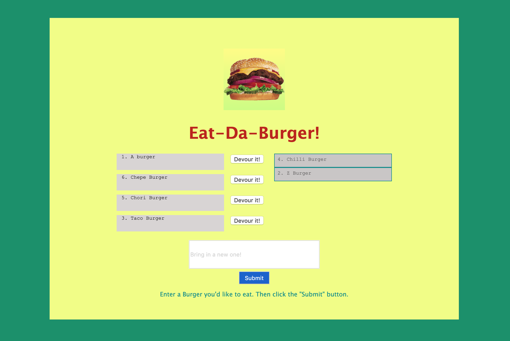

# Eat-Da-Burger
Homework Week 14

## Overview
In this assignment, you'll create a burger logger with MySQL, Node, Express, Handlebars and a homemade ORM (yum!). Be sure to follow the MVC design pattern; use Node and MySQL to query and route data in your app, and Handlebars to generate your HTML.

### Bring your best burgers and try the site to devour them!

* [Eat-Da-Burger](https://secret-sierra-61841.herokuapp.com/)

## Eat-Da-Burger details - What the project does  
* Eat-Da-Burger! is a restaurant app that lets users input the names of burgers they'd like to eat.  
* Whenever a user submits a burger's name, your app will display the burger on the left side of the page waiting to be devoured.  
* Each burger in the waiting area also has a Devour it! button. When the user clicks it, the burger will move to the right side of the page.  
* Your app will store every burger in a database, whether devoured or not.  

## Eat-Da-Burger's Purpose - Why the project is useful  
From a developer standpoint, Eat-Da-Burger wraps and reinforce the concepts learned during week 14.  

From a user standpoint, there is not much that Eat-Da-Burger could do for you, but to have some fun.  
Try it out!

## How users can get started with the project  
Just go to the link and test it out. It is very intuitive and friendly.

## Where can users get help with your project  
Feel free to clone the repo and explore my code, remember to install all require packages in order to work.

## Who mantains and contribute to the project  
That would be me: Sergio Rodriguez  
Feel free to contact me through Github!
